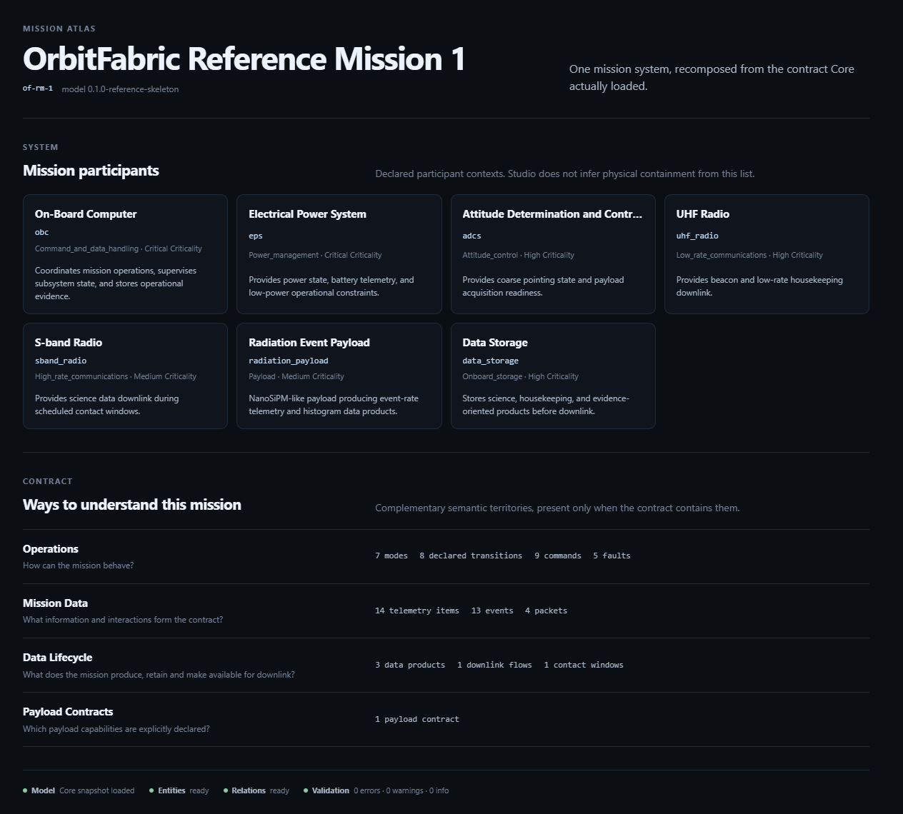
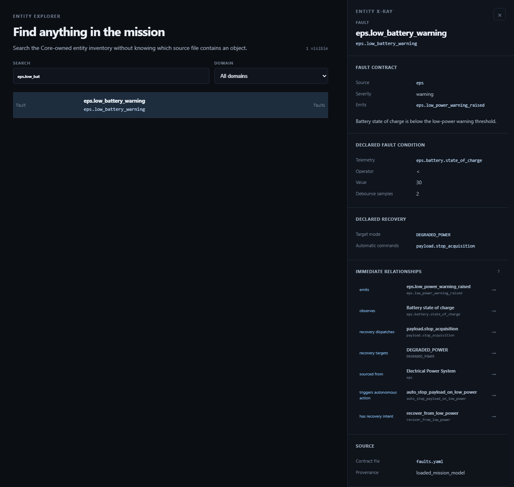

# 24, Mission Atlas and Entity X-Ray

Status: Studio Preview 1 tutorial  
Scope: mission-wide orientation, transversal entity discovery and provenance-aware inspection

## Purpose

After opening the Reference Mission, the first engineering problem is orientation:

```text
What exists in this mission, and how do I move from the whole mission to one exact contract entity?
```

Studio Preview 1 answers this through complementary views:

```text
Mission Atlas
-> Entity Explorer
-> Entity X-Ray
```

These views do not add mission semantics. They reorganize Core-owned facts so that a human can navigate them efficiently.

## Mission Atlas

Mission Atlas provides a presence-driven view of the mission structure.

For the Reference Mission, the reader should be able to recognize the major contract areas already introduced in the tutorial:

- spacecraft identity;
- subsystems;
- modes;
- telemetry;
- commands;
- events;
- faults;
- payloads;
- data products;
- contact and downlink concepts;
- commandability and autonomy.

The Atlas should be read as an orientation surface, not as a replacement for the source model.

Its value is that the reader no longer needs to infer mission structure from a directory of YAML files.



*Figure 24-1 — Mission Atlas for the OrbitFabric Reference Mission. The surface recomposes Core-owned mission facts into an engineering-oriented overview without changing semantic authority.*

## Entity Explorer

The next question is more specific:

```text
Where is the exact entity I want to understand?
```

Entity Explorer provides transversal search and domain filtering across the indexed Mission Data Contract.

A useful Reference Mission example is:

```text
eps.low_battery_warning
```

This is a fault entity introduced earlier in the tutorial.

Searching for it in Studio should resolve the domain-qualified entity rather than relying on textual filename proximity or a guessed ID convention.

That distinction matters because Studio identity is:

```text
{ domain, id }
```

The same textual ID may legitimately exist in different Mission Model domains.

## Entity X-Ray

Selecting an indexed entity opens Entity X-Ray.

Entity X-Ray is intended to answer questions such as:

```text
What type of entity is this?
What Core-owned fields define it?
Which immediate explicit relationships are available?
Where did this fact come from?
```

For `eps.low_battery_warning`, the reader should be able to inspect the fault as a contract entity rather than merely as a YAML fragment.

The underlying Reference Mission declares, among other things:

```text
source: eps
severity: warning
condition telemetry: eps.battery.state_of_charge
recovery target mode: DEGRADED_POWER
auto command: payload.stop_acquisition
```

Studio is allowed to present those facts and link to explicit relationships emitted by Core.

It is not allowed to invent a new causal relation because two fields look related.



*Figure 24-2 — Entity Explorer and Entity X-Ray for `eps.low_battery_warning`, including the declared fault condition, recovery facts, immediate explicit relationships and source provenance.*

## Provenance matters

A visual workbench becomes dangerous if it makes facts easier to see but harder to trace.

Studio therefore keeps provenance as part of mission understanding.

The intended reasoning pattern is:

```text
visible fact
-> indexed entity
-> Core-owned field or relationship
-> Mission Model source
```

The UI is an inspection surface, not a semantic hiding layer.

## Global selection

Studio maintains a global domain-qualified selection across mission views.

That means the reader can select a fault in Entity Explorer, then move into relationship or operational views without silently changing the engineering subject.

This is an interaction convenience, not a new Core concept.

## What this step proves

This step demonstrates that Studio can reduce the cost of answering two basic engineering questions:

```text
What exists?
What exactly is this entity?
```

It does so using Core-owned Mission Snapshot and Entity Index information, plus explicit relationships and provenance.

It does not prove:

- automatic design review;
- mission completeness scoring;
- health scoring;
- semantic inference from raw YAML;
- editing of the entity.

## Modeling rule introduced in this step

The twenty-fourth rule is:

```text
Visual navigation may reorganize Core-owned facts, but entity identity and provenance must remain explicit.
```

## What comes next

The next step follows the explicit relationship context around this same fault and uses the Reference Mission FDIR chain as a concrete navigation example.
