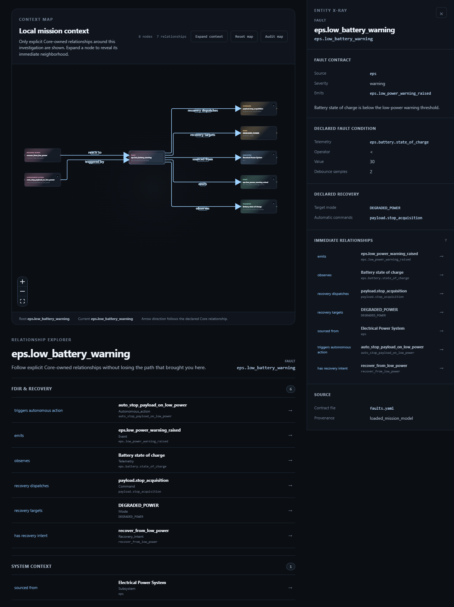

# 25, Following Relationships and FDIR Context

Status: Studio Preview 1 tutorial  
Scope: Relationship Explorer, Context Path and Context Map using explicit Core-owned FDIR relationships

## Purpose

The Reference Mission becomes especially useful in Studio when the reader stops looking at isolated entities and starts asking:

```text
How is this fact connected to the rest of the mission contract?
```

This step follows one concrete FDIR-oriented path around the low-power protection logic already introduced in the model and scenario walkthroughs.

The important constraint is strict:

```text
Studio may navigate explicit Core-owned relationships.
Studio must not invent a causal graph.
```

## Reference Mission FDIR example

The model contains a useful engineering chain around low battery state:

```text
eps.battery.state_of_charge
        ↓
eps.low_battery_warning
        ↓
DEGRADED_POWER
        ↓
payload.stop_acquisition
```

This compact diagram is only a reader aid.

The actual relationship context is represented by separate explicit contract facts, including:

- the fault observes `eps.battery.state_of_charge`;
- the fault recovery targets `DEGRADED_POWER`;
- the fault recovery dispatches `payload.stop_acquisition`;
- the autonomous action `auto_stop_payload_on_low_power` is triggered by `eps.low_battery_warning`;
- that autonomous action dispatches `payload.stop_acquisition` using `onboard_autonomy`;
- the recovery intent `recover_from_low_power` targets `DEGRADED_POWER` and includes `payload.stop_acquisition`.

Core emits these as explicit relationship families.

Studio does not derive them by parsing descriptions, threshold expressions or textual ID similarity.

## Relationship Explorer

Starting from `eps.low_battery_warning`, Relationship Explorer groups immediate explicit relationships by engineering intent.

This is useful because a raw relationship list can become difficult to interpret even when every individual record is correct.

Studio may group and label the records for presentation, but the underlying relationship meaning remains Core-owned.

A reader should use this view to answer:

```text
What does this fault observe?
What does its recovery request?
Which autonomous logic references it?
Which mode and command are explicitly connected to it?
```

## Context Path

Context Path records the relationship path actually followed by the user.

That distinction is important.

Context Path is not an automatically inferred system-level causal chain.

It is better understood as:

```text
my current engineering investigation
```

For example, the reader may follow:

```text
eps.low_battery_warning
-> payload.stop_acquisition
-> stop_payload_acquisition_rule
```

or:

```text
eps.low_battery_warning
-> DEGRADED_POWER
```

The path communicates navigation history without claiming that Studio has discovered an undocumented causal dependency.

## Context Map

Context Map visualizes explicit relationship neighborhoods.

Preview 1 uses only Core-owned relationship records as semantic edges. Layout, routing, expansion and visual emphasis are presentation concerns.

The user can:

- select nodes;
- pan and zoom;
- explicitly expand context;
- progressively request more context;
- reset the map;
- see the current neighborhood emphasized.

The map should therefore be read as an interactive projection of declared relationships, not as a graph engine that discovers new mission semantics.



*Figure 25-1 — Context Map and Relationship Explorer around `eps.low_battery_warning`. The graph exposes only explicit Core-owned relationships, while the explorer keeps the same FDIR and system-context facts inspectable as structured relationships.*

## Why the new FDIR Relationship Manifest extension matters

Earlier versions of the relationship surface could expose many useful mission connections but did not make the full FDIR context explicit enough for a downstream visual tool.

The current post-v1.1 Core development adds seven explicit relationship families:

```text
autonomous_action_triggered_by_fault
autonomous_action_uses_command_source
fault_observes_telemetry
fault_recovery_dispatches_command
fault_recovery_targets_mode
recovery_intent_includes_command
recovery_intent_targets_mode
```

These families are additive.

They do not turn the Relationship Manifest into an inferred dependency graph, and they do not change the meaning of the original v1 relationship families.

For the Reference Mission, they allow Studio to show a much more useful FDIR neighborhood without private heuristics.

## Engineering interpretation

The visual result can make the low-power protection logic feel obvious.

That is useful, but the reasoning order must remain:

```text
Mission Model declaration
-> Core relationship record
-> Studio visualization
-> engineer interpretation
```

Never reverse that order into:

```text
Studio drew an edge
-> therefore the Mission Model must mean it
```

## What this step proves

This step demonstrates one of the strongest ecosystem-level benefits of the Reference Mission:

```text
A contract relationship declared once can become a machine-readable Core fact and then a navigable Studio engineering context.
```

It does not prove:

- automatic root-cause analysis;
- formal FDIR verification;
- runtime fault detection;
- hidden causal inference;
- a generic graph database.

## Modeling rule introduced in this step

The twenty-fifth rule is:

```text
A relationship shown by Studio must be traceable to an explicit Core-owned relationship record.
```

## What comes next

The next step changes lens again: instead of following arbitrary relationship neighborhoods, it asks what operational behavior is declared from a selected spacecraft mode.
