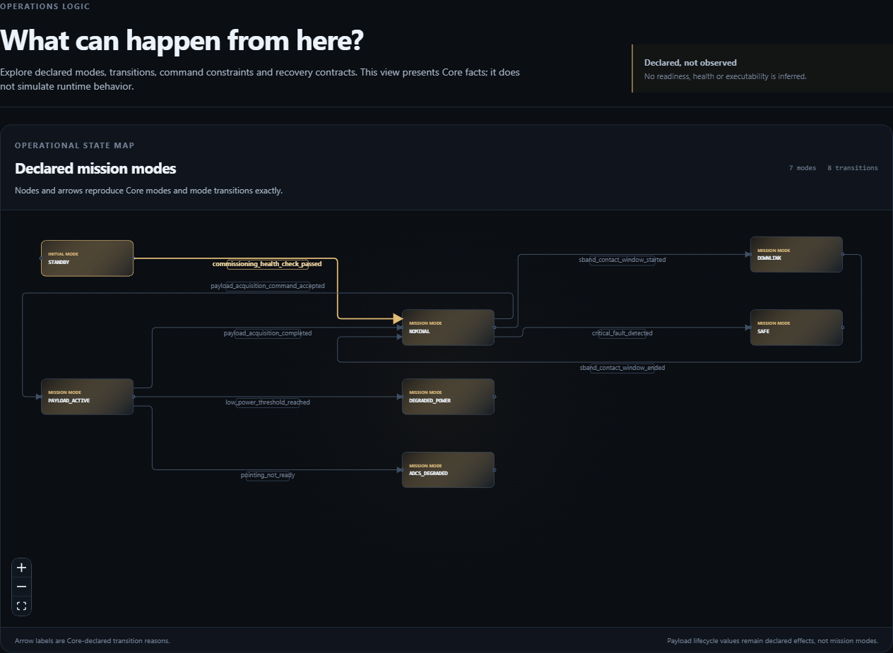
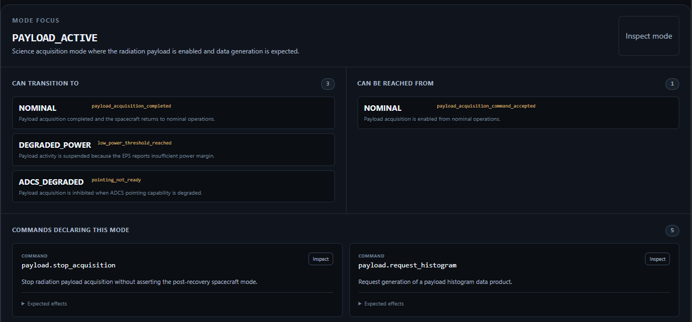

# 26, Understanding Operational Logic

Status: Studio Preview 1 tutorial  
Scope: Operational State Map and Mode Focus for declared transitions, commands, commandability and recovery context

## Purpose

The relationship views answer:

```text
How are declared mission entities connected?
```

The Operations Logic Lens asks a different engineering question:

```text
What can happen from here?
```

For a spacecraft mode, Studio Preview 1 brings together Core-owned operational facts without turning the UI into a simulator or mission-control console.

## Reference Mission mode set

The Reference Mission declares seven modes:

```text
SAFE
STANDBY
NOMINAL
PAYLOAD_ACTIVE
DOWNLINK
DEGRADED_POWER
ADCS_DEGRADED
```

The model also declares explicit transitions such as:

```text
STANDBY -> NOMINAL
NOMINAL -> PAYLOAD_ACTIVE
PAYLOAD_ACTIVE -> NOMINAL
PAYLOAD_ACTIVE -> DEGRADED_POWER
NOMINAL -> DOWNLINK
DOWNLINK -> NOMINAL
PAYLOAD_ACTIVE -> ADCS_DEGRADED
NOMINAL -> SAFE
```

These are model declarations. Studio renders them; it does not infer additional transitions because they might appear operationally plausible.

## Operational State Map

The Operational State Map gives a mission-level view of the declared mode topology.

It is useful for questions such as:

```text
Which modes exist?
Which transitions are explicitly declared?
Where are the nominal and protective branches?
Which operational regions are disconnected by design?
```

The visual geometry is presentation logic. The semantic nodes and edges come from Core-owned mission facts.



*Figure 26-1 — Operational State Map for the Reference Mission. All seven declared modes and eight explicit transitions are shown as static contract logic, not observed runtime state.*

## Mode Focus

Selecting a mode changes the question from mission-wide topology to local operational reasoning.

A particularly useful tutorial example is:

```text
PAYLOAD_ACTIVE
```

From this mode, the Reference Mission declares three important outgoing operational outcomes:

```text
PAYLOAD_ACTIVE -> NOMINAL
PAYLOAD_ACTIVE -> DEGRADED_POWER
PAYLOAD_ACTIVE -> ADCS_DEGRADED
```

These correspond to:

- nominal payload completion;
- low-power protective suspension;
- degraded-pointing protective inhibition.

The same mode is also relevant to commandability and recovery contracts, including the ability to stop payload acquisition from ground or onboard autonomy.

Mode Focus should therefore help the reader connect:

```text
selected mode
-> declared outgoing transitions
-> commands and commandability
-> recovery-related contract facts
```

without claiming to execute that behavior.



*Figure 26-2 — Mode Focus for `PAYLOAD_ACTIVE`. The selected mode is inspected locally through its declared outgoing and incoming transitions and the commands that explicitly declare this operational state.*

## Protective paths are expected behavior

The degraded branches in this mission are not tutorial failures.

They are expected protective behavior:

```text
PAYLOAD_ACTIVE
   | low power
   v
DEGRADED_POWER
```

and:

```text
PAYLOAD_ACTIVE
   | pointing degraded
   v
ADCS_DEGRADED
```

The earlier scenario walkthroughs exercised these paths as deterministic scenario evidence.

Preview 1 does not replay those scenarios in the Operations view.

Instead, it lets the engineer inspect the static operational contracts that make those paths meaningful.

This distinction must remain explicit because Scenario Catalog and Scenario Replay / Evidence are deferred capabilities, not Preview 1 features.

## Commands and commandability

The Reference Mission also declares commandability rules.

For example, `payload.stop_acquisition` may be requested from both:

```text
ground_ops
onboard_autonomy
```

in explicitly allowed modes including protective states.

Studio may bring these declared facts into Mode Focus so that the user can understand which commands are relevant from the selected operational state.

It must not convert those declarations into a live command interface.

## Recovery context

Recovery contracts can also be presented alongside modes when Core explicitly connects them.

For low-power operation, the Reference Mission declares `DEGRADED_POWER` as a recovery target and `payload.stop_acquisition` as part of the protective response.

That makes the Operations lens complementary to the FDIR Context Map:

```text
Relations lens   -> how contract entities are explicitly connected
Operations lens  -> what declared operational behavior surrounds a mode
```

Neither lens owns the underlying semantics.

## What this step proves

This step demonstrates that Studio can make a spacecraft operational model easier to reason about without becoming a simulator.

The correct claim is:

```text
Studio can render and organize Core-declared operational logic for human inspection.
```

The incorrect claims are:

```text
Studio predicts spacecraft behavior.
Studio executes mode transitions.
Studio validates flight runtime state.
Studio is a mission-control console.
```

## Modeling rule introduced in this step

The twenty-sixth rule is:

```text
Operational visualization must distinguish declared contract logic from executed runtime behavior.
```

## What comes next

The final tutorial step closes the Reference Mission by putting Core and Studio into one end-to-end engineering workflow and by stating exactly what this reference demonstrates.
