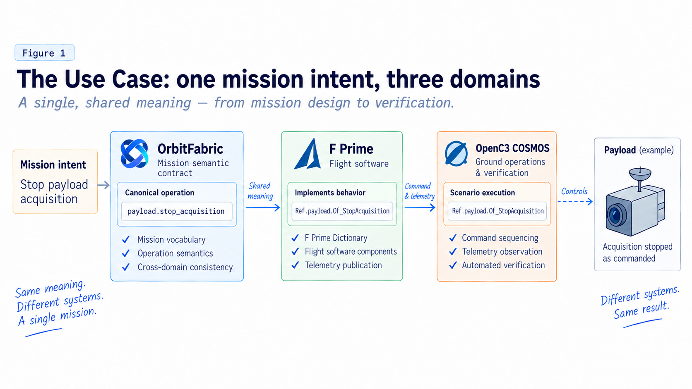
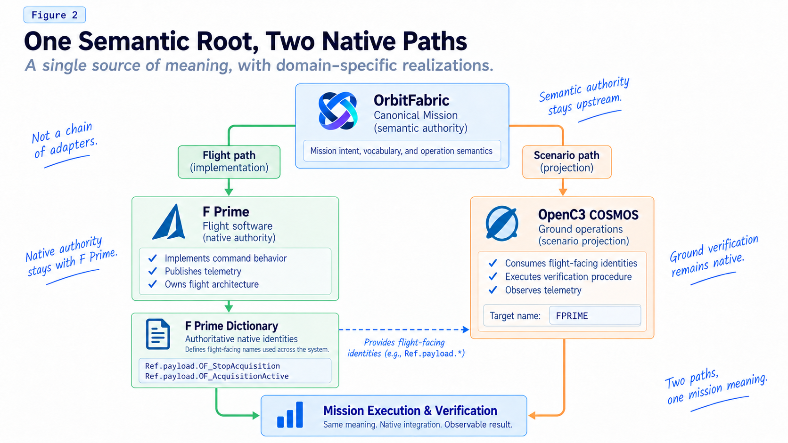
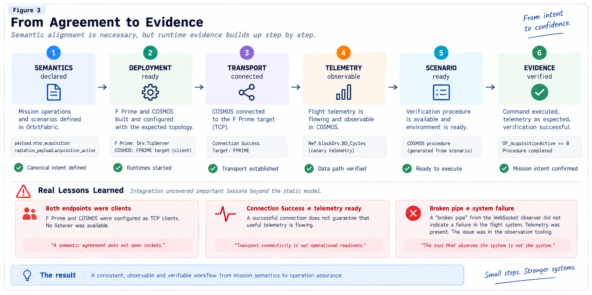

# One Mission Contract Across Flight and Ground

*A mission has concepts that should mean one thing, even when those concepts must live inside systems that have good reasons to be different.*

That problem appears long before we choose a flight software framework, a ground system, or a dictionary format.

Take a seemingly simple mission intent:

> Stop payload acquisition.

At mission level, that means one thing.

In flight software, however, it must become a real command. It needs an identity, an owning component, command handling, transport, and executable behavior.

On the ground, the same intent must become something an operator can actually send.

Then a second question appears immediately:

> How do we know the payload really stopped?

Now telemetry enters the picture. Then verification. Then, perhaps, a wider operational scenario that also expects an event, a lifecycle transition, or an overall result.

What started as one mission concept begins to exist in several engineering forms:

```text
mission intent
    ↓
flight command
    ↓
native dictionary
    ↓
ground command
    ↓
telemetry
    ↓
verification procedure
```

There is nothing inherently wrong with that.

Flight software and ground software are different because they solve different problems. They have different architectures, tools, owners, constraints, and development cycles.

The problem begins when, in addition to the implementation, the **meaning itself** is duplicated.

A command is renamed in flight software while the previous name survives in a ground procedure.

A telemetry identity changes in a dictionary while verification logic still expects the old one.

A mission scenario contains an expectation that the current ground integration cannot yet express, so that expectation is quietly removed downstream. Over time, the reduced downstream representation starts to look like the mission definition itself.

None of these failures requires a dramatic design mistake.

They can emerge from perfectly reasonable local decisions made by teams that are doing good work in systems that evolve independently.

The interesting question is therefore not how to make flight and ground identical.

It is this:

**Can we maintain one semantic root for the mission without forcing flight and ground to share one implementation?**

To explore that question, we decided not to stop at an architecture diagram.

We built a concrete use case.

---

## Suppose we need to stop an acquiring payload

Imagine a small spacecraft mission with a scientific payload.

The payload is already acquiring data.

From the ground, we need to stop that acquisition and verify that it really stopped.

The operational requirement is easy to describe:

> The ground sends a stop-acquisition command. The flight software executes it. Telemetry shows that acquisition is no longer active. The ground verifies the result.

It almost sounds too simple to justify an architectural experiment.

That is exactly why it is useful.

If a path this small is difficult to keep aligned, the problem will not become easier when a mission contains hundreds of commands, telemetry items, modes, events, and procedures.

For the experiment, we assigned each engineering domain a concrete actor.

### OrbitFabric: mission-level meaning

OrbitFabric maintains the canonical semantic contract.

For this vertical slice, the two central identities are:

```text
payload.stop_acquisition

radiation_payload.acquisition_active
```

The first expresses something the mission can ask the payload to do.

The second expresses the state needed to observe whether acquisition is still active.

At this level, these are not yet F Prime names.

They are not COSMOS commands.

They do not describe a socket or define a packet ID.

They identify mission concepts.

### F Prime: the flight realization

On the flight side, we used F Prime.

F Prime keeps ownership of its native architecture: components, command and telemetry interfaces, topology, command handling, packet allocation, transport, and runtime behavior.

F Prime is responsible for realizing the command as something executable.

It also produces the Dictionary that describes what the flight system actually exposes.

### OpenC3 COSMOS: operations and verification

On the ground side, we used OpenC3 COSMOS.

COSMOS keeps ownership of its target, interface lifecycle, telemetry processing, operator-facing command representation, procedure execution, and verification behavior.

Its job is not to become a ground-side OrbitFabric runtime.

It must remain COSMOS.



With the actors on the table, the problem becomes much more precise.

The mission knows:

```text
payload.stop_acquisition
```

F Prime must turn that into a command that can actually execute.

COSMOS must know the command the flight system really exposes.

And all three domains must still refer to the same mission intent.

The simplest implementation would be to duplicate that knowledge.

The flight team defines its command.

The ground team manually configures a corresponding command.

A procedure checks an agreed telemetry item.

As long as everyone remembers to update everything together, it works.

But now the meaning of *stop acquisition* exists implicitly in several places.

That semantic duplication is what we wanted to challenge.

---

## One semantic root, two native paths

The solution used in the Reference Project starts with a deliberate separation.

OrbitFabric does not generate one universal system that later splits into flight and ground.

And the adapters are not arranged as a generic serial chain in which the output of one adapter becomes the input of the next.

Instead, there are **two distinct engineering paths that start from the same semantic root**.

On the flight path, canonical identities are projected toward a native F Prime realization.

On the scenario path, the canonical Scenario is projected independently toward the verification intent currently supported by COSMOS.

The two paths later converge through one particularly important artifact: the F Prime Dictionary.



The Dictionary is not just an intermediate file in this architecture.

It is an authority boundary.

We begin with the canonical identity:

```text
payload.stop_acquisition
```

The native F Prime realization exposes:

```text
Ref.payload.OF_StopAcquisition
```

Likewise:

```text
radiation_payload.acquisition_active
```

is realized by the flight system as:

```text
Ref.payload.OF_AcquisitionActive
```

At this point, OrbitFabric could also try to tell the ground system exactly what those F Prime names will be.

That would be the wrong ownership model.

It would make OrbitFabric authoritative over a native flight realization that belongs to F Prime.

We chose the opposite direction.

OrbitFabric remains authoritative over mission meaning.

F Prime remains authoritative over its native realization.

The F Prime Dictionary describes what the flight software actually produced.

COSMOS consumes those native flight-facing identities downstream.

In compact form:

```text
MISSION MEANING
      ↓
canonical identity
      ↓
F Prime realization
      ↓
F Prime Dictionary
      ↓
ground consumption
```

This distinction may look subtle, but it is one of the most important results of the experiment.

The real question is not:

> How do we make every system use the same name?

It is:

> Which system has the right to be authoritative over each kind of information?

The mission contract is authoritative over meaning.

F Prime is authoritative over the native flight realization.

COSMOS is authoritative over its ground-side realization and verification lifecycle.

The architecture connects those authorities instead of replacing them with one.

---

## Following `stop_acquisition` across the boundary

We can now follow the use case end to end.

The mission defines:

```text
payload.stop_acquisition
```

The flight path binds that concept to the native F Prime command:

```text
Ref.payload.OF_StopAcquisition
```

F Prime publishes that identity in its Dictionary.

COSMOS consumes that flight-facing identity through the `FPRIME` target.

The observation side follows the same pattern.

The mission-level identity:

```text
radiation_payload.acquisition_active
```

is realized as:

```text
Ref.payload.OF_AcquisitionActive
```

and that is the telemetry item used downstream for verification.

The path can therefore be summarized in five steps:

1. OrbitFabric identifies the command semantically.
2. The projection binds it to the F Prime realization.
3. F Prime realizes the command and publishes its native identity in the Dictionary.
4. The ground side consumes the identity that the flight system actually exposes.
5. COSMOS uses that identity to operate and verify the system.

The canonical relationship remains traceable.

But neither downstream system is forced to give up its native engineering model.

---

## The Scenario is richer than the current integration

The command is only one part of the use case.

At mission level, the Scenario says more than:

> Send stop acquisition and check one telemetry value.

Conceptually, the payload starts active.

A stop-acquisition command is issued.

The mission expects acquisition to complete, `acquisition_active` to become false, the payload lifecycle to return to the expected state, and the overall Scenario to complete successfully.

That is the mission-level story.

The current COSMOS projection cannot express all of it.

The canonical Scenario contains eight source atoms.

Three are projected into the currently supported executable subset.

Five remain explicitly classified as:

```text
not_projected
```

That incompleteness is deliberate.

We could have simplified the canonical Scenario until it contained only the three atoms that COSMOS can currently execute.

The downstream integration would have looked more complete.

The mission contract would have become less complete.

Instead, the projection declares its limit.

That preserves a crucial direction of authority:

**A downstream integration limitation must not redefine the upstream mission contract.**

There is a fundamental difference between saying:

> The mission does not expect this.

and saying:

> This projection cannot represent it yet.

Only the second statement allows the downstream integration to become more capable later without forcing the mission definition to be rewritten around yesterday's limitations.

---

## What do we actually gain?

At this point, it is worth stopping and asking a fair question.

We introduced a canonical mission contract.

We introduced explicit projections.

We separated authority boundaries.

We preserved unsupported Scenario semantics instead of flattening them away.

All of that adds structure.

So is it actually worth it?

For one command and one telemetry item, the answer cannot simply be “yes, because there is less work.”

There may not be less work.

The value is somewhere else.

### One stable place for meaning

`payload.stop_acquisition` does not have to be invented independently in flight software, in the ground system, and in verification logic.

There is a shared semantic root from which those native realizations can be related.

### Native ownership is preserved

F Prime still owns the flight architecture.

COSMOS still owns the ground system.

There is no universal runtime that both sides must adopt.

That limits coupling.

### Downstream truth remains downstream

The F Prime Dictionary remains authoritative over what the flight software actually exposes.

OrbitFabric does not need to duplicate every native detail of the flight implementation.

That reduces the risk of creating a second description of the flight system that can drift away from the system itself.

### Integration gaps become visible

`not_projected` is useful information.

It tells us exactly where the current projection stops.

That is more valuable than an apparently complete projection created by silently removing what cannot yet be represented.

### Evolution becomes more inspectable

When a downstream realization changes, there is an explicit relationship back to the canonical concept.

The architecture does not remove change.

It makes change easier to reason about and verify.

There is also a cost.

The canonical contract must be maintained.

Projection boundaries must be explicit.

Tooling is required.

Verification is required.

And none of this eliminates runtime integration.

We learned that immediately.

---

## Then we tried to run it

Statically, everything looked correct.

The canonical identities were correct.

The F Prime projection was correct.

The F Prime realization exposed the expected identities.

The Dictionary was correct.

The COSMOS procedure used the right native identities.

Then we started the live systems.

Nothing communicated.

The reason had nothing to do with semantics.

Both TCP endpoints were clients.

There was no listener.

It was an almost trivial networking mistake.

It was also one of the most useful findings in the whole experiment.

We had achieved static semantic agreement between systems that still had no deployable communication topology.

The lesson is simple:

**Declaration is not deployment.**

A semantic contract can establish what concepts correspond.

A Dictionary can describe the command and telemetry interfaces exposed by the flight application.

A ground procedure can use exactly the correct native identities.

None of those artifacts necessarily answers a runtime question such as:

> Which process listens on this TCP connection?

Nor should they necessarily answer it.

The correction therefore stayed where the problem belonged: in the downstream Reference Project.

F Prime was configured with `Drv.TcpServer`.

OpenC3 COSMOS remained the client.

We did not modify OrbitFabric Core to solve a socket-topology problem.

We did not expand the adapters until the proof happened to pass.

We corrected deployment topology in the system that owned it.

That small failure reinforced a much larger boundary:

**Static semantic agreement does not define runtime topology.**

---

## Connected does not mean ready

Once the topology was correct, another assumption had to go.

A successful connection does not prove that the mission data path is operational.

During the experiment, we ended up distinguishing several different states:

```text
plugin loaded
      ↓
interface ready
      ↓
transport connected
      ↓
telemetry observable
      ↓
scenario ready
      ↓
verification complete
```

None of those steps automatically implies the next.



In particular, `Connection Success` only proves something about the transport connection.

It does not prove that useful flight telemetry is crossing the complete path and becoming observable in COSMOS.

Before executing the actual Scenario verification, we therefore introduced an independent readiness condition.

F Prime already exposes a periodic native telemetry item suitable for this purpose:

```text
Ref.blockDrv.BD_Cycles
```

We used it as a canary.

The runner does not start the Scenario verification until `BD_Cycles` is actually observable from COSMOS.

The readiness flow is deliberately short:

1. Start the runtimes.
2. Establish the connection.
3. Observe real F Prime telemetry.
4. Declare the telemetry path ready.
5. Only then execute the mission verification.

That separation makes failures easier to interpret.

If the readiness telemetry never appears, there is little reason to investigate `payload.stop_acquisition` semantics.

The failure is lower in the stack.

If readiness succeeds and the mission verification fails later, the search space is different.

---

## The observer can fail while the system is healthy

The local reproduction exposed one more useful distinction.

At one point, telemetry had in fact arrived.

`BD_Cycles` had reached 10.

The observed system was healthy.

But the WebSocket monitor used by `openc3cli script run` reported a `Broken pipe`.

If we had looked only at the observer's exit path, we could have classified the system as failed.

The runtime evidence said otherwise.

Telemetry was present.

The data path was working.

The failure belonged to the observation mechanism.

The runner was changed to use a more robust sequence based on:

```text
script spawn
```

followed by:

```text
script status
```

The specific command is less important than the boundary it exposed:

**Observation tooling is not the system being observed.**

In a serious end-to-end proof, even the tooling used to observe the system must be treated as a possible source of failure.

---

## Back to the payload

We started with one simple operational need.

The payload is acquiring.

The ground needs to stop it.

Now the complete live path can be stated plainly:

1. COSMOS sends `Ref.payload.OF_StopAcquisition`.
2. F Prime receives and dispatches the command.
3. The Reference Project executes the flight-side behavior.
4. `OF_AcquisitionActive` changes to `false`.
5. F Prime publishes the updated telemetry.
6. COSMOS observes `OF_AcquisitionActive == 0`.
7. The verification completes successfully.

That is the point where the two engineering paths converge.

The meaning originates upstream.

The flight realization remains native.

The ground realization remains native.

The flight behavior remains owned by the Reference Project.

Verification remains owned by the ground system.

And the complete path is supported by executable evidence rather than by architectural intent alone.

---

## Was it worth it?

For this vertical slice, yes — but not because the architecture made the problem disappear.

It did not.

We still had to build a flight realization.

We still had to generate and consume a native F Prime Dictionary.

We still had to configure COSMOS.

We still had to establish runtime topology.

We still had to define readiness.

We still had to debug observation tooling.

What changed was the **location and visibility of the complexity**.

The mission meaning had one explicit root.

Native implementation details stayed native.

Ownership boundaries were visible.

Unsupported projections were visible.

Runtime problems remained runtime problems instead of being absorbed into the semantic layer.

The solution does not eliminate complexity.

**It moves part of the complexity from implicit conventions into explicit, inspectable, and verifiable relationships.**

That is a much more modest claim than “write once, run everywhere.”

It is also, for engineering systems that must evolve independently, a much more useful one.

---

## What R1 proved — and what it did not

R1 proved one bounded vertical slice.

It demonstrated that:

- canonical OrbitFabric mission identities can remain the semantic root;
- a native F Prime realization can preserve F Prime ownership;
- the resulting F Prime Dictionary can remain authoritative for flight-facing identities;
- a canonical Scenario can be projected independently into the executable COSMOS subset;
- unsupported Scenario semantics can remain explicitly `not_projected` rather than being removed upstream;
- COSMOS can send the resolved native F Prime command and observe the resulting native telemetry;
- the complete live loop can be reproduced and retained as evidence.

R1 did **not** demonstrate:

- generation of an arbitrary F Prime project from OrbitFabric;
- generation of generic F Prime runtime topology;
- generation of flight behavior from Scenario `expected_effects`;
- OrbitFabric ownership of F Prime packet allocation;
- execution of the complete canonical Scenario by COSMOS;
- generic event, mode, or lifecycle projection;
- arbitrary F Prime Dictionary support;
- generic serial composition of adapters;
- universal cross-adapter interoperability.

Those boundaries matter because a useful Engineering Story should make the demonstrated result clearer, not larger.

---

## One root, two systems, one live result

We began with a small operational question:

> Can the ground stop a payload and verify the result without flight and ground independently reconstructing the same mission meaning?

The answer from this experiment was yes.

Not because F Prime became OrbitFabric.

Not because COSMOS became OrbitFabric.

Not because one adapter generated an entire end-to-end system.

The result came from preserving authority at the right boundaries and then proving that those boundaries could converge at runtime.

The mission contract remained the semantic root.

F Prime remained a native flight software system.

COSMOS remained a native ground operations and verification system.

And the Reference Project showed the three working together on one concrete mission slice.

**One semantic root. Two native engineering paths. Native ownership preserved. Runtime convergence demonstrated.**

The next layer is the Technical Deep Dive, where the exact projection profiles, generated artifacts, runtime topology, retained evidence, and reproduction path are examined in detail.
