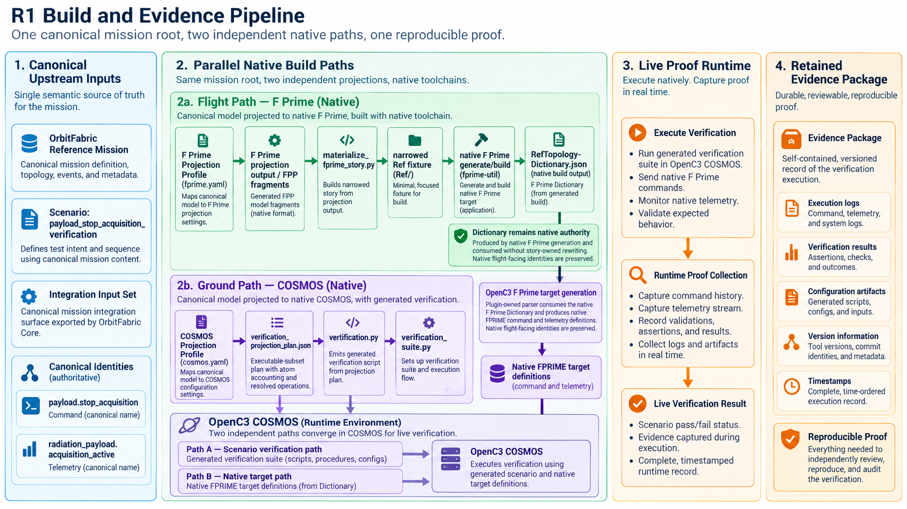
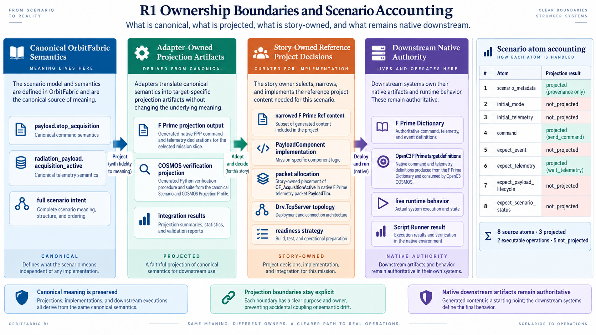
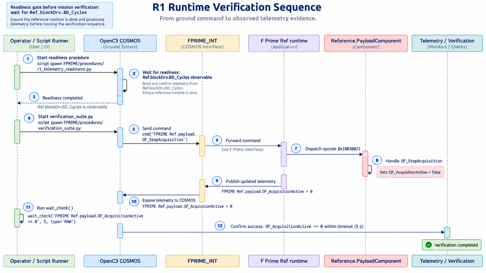

# Technical Deep Dive: One Mission Contract Across Flight and Ground

This Deep Dive starts where the Engineering Story leaves off.

The front Story explains why a shared mission-level semantic root matters when flight and ground systems remain independently owned. This document follows the accepted R1 proof down to the exact projections, native artifacts, runtime topology, readiness gates and retained evidence.

If you have not read the Story yet, start there first:

[Read the Engineering Story: One Mission Contract Across Flight and Ground](index.md)

The question here is deliberately narrower:

> What, exactly, was projected, built, resolved, executed and retained as evidence?

R1 proves one vertical slice around a real mission command and telemetry concept, realized natively in F Prime and verified in OpenC3 COSMOS, while preserving explicit ownership boundaries between the mission contract, flight implementation and ground implementation.

---

## 1. Evidence baseline and scope

The accepted executable Reference Project baseline is:

```text
d66f6068235d425bdc2335d4b0cb09a58e70c1de
```

The retained evidence package was sealed later at:

```text
c90a7c6d44d018006a4f8f0825411e3f27540fc2
```

The evidence index records the accepted Reference Project commit, all pinned downstream baselines, the canonical and native identities, workflow results, artifact digests and the successful local live reproduction.

The exact accepted baselines are:

| Product | Accepted baseline |
|---|---|
| OrbitFabric Core | `a25917e81c90396df2b189834e83cf852fa4da5f` |
| OrbitFabric F Prime adapter | `598f0ca09a39c10b17e3c588d0f2c7112fe52e06` |
| OrbitFabric OpenC3 COSMOS adapter | `1e6f477ba0571996fa72dfd0b719a522dcc84ff1` |
| NASA F Prime | `8a62e455a90b6d4f498c332d45d65a2a819988d8` |
| FPP | `93f484b7521a8e8894cba25b26e633cc87d8e37a` |
| OpenC3 F Prime plugin | `f80d6a2d112a9f2680ad9f404bca2ac116315d33` |
| OpenC3 COSMOS project runtime | `9eb454f06fe0113d05aa6945d88b627155a2aa47` |

The F Prime Projection Profile pins F Prime `v4.2.2` and FPP `3.2.0`. The COSMOS verification plan records OpenC3 COSMOS `v7.3.0`. The accepted local reproduction used Debian GNU/Linux 12 with Python `3.12.13`.

The proof was accepted by three independent gates:

| Gate | Accepted run | Result |
|---|---:|---|
| Reference Mission CI | run 31, ID `34048036024` | PASS |
| R1 Flight Ground Proof | run 26, ID `34048036012` | PASS |
| R1 Live Flight Ground Proof | run 18, ID `34048036011` | PASS |

The static and live workflows both executed against the accepted Reference Project commit `d66f606...`. The retained evidence also records SHA-256 digests for the corresponding workflow artifacts.

!!! note "Scope discipline"
    R1 is not a full F Prime realization of the Reference Mission, not a full COSMOS execution of the canonical Scenario, and not a generic adapter-composition proof. It is one accepted command/telemetry verification slice.

---

## 2. The canonical mission slice

The slice starts in the Reference Mission, not in either downstream tool.

The canonical command is:

```text
payload.stop_acquisition
```

Its mission contract says that the command targets the radiation payload, is valid in several operational modes including `PAYLOAD_ACTIVE`, emits `payload.acquisition_completed`, expects the payload lifecycle to become `READY`, and expects:

```text
radiation_payload.acquisition_active = false
```

The canonical telemetry concept is:

```text
radiation_payload.acquisition_active
```

It is a boolean produced by the radiation payload and represents whether science acquisition is currently active.

The payload model also declares:

```text
radiation_event_payload
```

with lifecycle states including:

```text
OFF
READY
ACQUIRING
HISTOGRAM_READY
DOWNLINK_PENDING
FAULT
```

and declares both `payload.stop_acquisition` and `radiation_payload.acquisition_active` as part of the payload's accepted command and produced telemetry surfaces.

The event:

```text
payload.acquisition_completed
```

is likewise canonical mission meaning. Nothing in the mission model says that this event must be represented through a particular F Prime event identity or a particular COSMOS observation mechanism.

That distinction becomes important later.

### The canonical verification Scenario

R1 uses:

```text
scenarios/payload_stop_acquisition_verification.yaml
```

Its mission-level intent is:

```text
initial mode:       PAYLOAD_ACTIVE
initial telemetry:  acquisition_active = true

command:            payload.stop_acquisition
expect event:       payload.acquisition_completed
expect telemetry:   acquisition_active = false
expect lifecycle:   radiation_event_payload = READY
expect result:      scenario_status = PASSED
```

This is richer than the executable COSMOS subset used in R1.

That is deliberate. The canonical Scenario describes what the mission means. The projection describes which part of that meaning the current target integration can realize.

---

## 3. One Core input, two independent projection paths

The Reference Project first asks OrbitFabric Core to export the canonical Integration Input Set:

```bash
orbitfabric export integration-input-set mission/ \
  --output-dir <work>/input-set
```

For the accepted COSMOS plan, the exported input set is identified by:

```text
kind:              orbitfabric.integration_input_set
input_set_version: 0.1-candidate
mission_id:        of-rm-1
model_version:     0.1.0-reference-skeleton
SHA-256:           4bbdca769e4b8fdee51719a47acaa49e9a552b4360f96d8664947514b074ef34
```

From that common semantic root, R1 creates two separate paths:

```text
                         OrbitFabric Reference Mission
                                   + Core
                                     |
                    +----------------+----------------+
                    |                                 |
                    v                                 v
           F Prime Projection                 COSMOS Scenario Projection
                Profile                              Profile
                    |                                 |
                    v                                 v
            FPP declarations                  verification plan
                    |                                 |
                    v                                 v
          native F Prime project               COSMOS procedure
                    |
                    v
          native F Prime Dictionary
                    |
                    v
           OpenC3 F Prime target
                    |
                    +---------------+
                                    |
                                    v
                         live COSMOS <-> F Prime
```

The two adapters are therefore **not** used as a generic serial pipeline.

The F Prime adapter does not feed the COSMOS adapter.

The COSMOS adapter projects the canonical Scenario independently. The two paths converge downstream because the generated COSMOS procedure references native F Prime identities that must exist in the OpenC3 target generated from the native F Prime Dictionary.

This is an important nuance: the Dictionary remains authoritative for what F Prime actually exposes, while the COSMOS Projection Profile remains explicit target-side projection intent. R1 proves that the two agree. It does not pretend that one adapter automatically derives the other's configuration.



*Figure 1. The canonical mission root feeds independent F Prime and COSMOS paths, which converge in the native OpenC3 runtime and produce retained evidence.*

---

## 4. Flight path: canonical identities to F Prime target intent

The accepted F Prime Projection Profile is intentionally small.

For the command it declares:

```yaml
- id: payload-stop
  sources:
    - domain: commands
      id: payload.stop_acquisition
  config:
    kind: command
    host_component: Reference.PayloadComponent
    host_instance: payload
    symbol: OF_StopAcquisition
    local_opcode: 33
    command_kind: async
    priority: 0
    queue_full_behavior: drop
```

For telemetry:

```yaml
- id: payload-active
  sources:
    - domain: telemetry
      id: radiation_payload.acquisition_active
  config:
    kind: telemetry
    host_component: Reference.PayloadComponent
    host_instance: payload
    symbol: OF_AcquisitionActive
    local_id: 16
    update: on_change
```

The distinction between **canonical source identity** and **target projection intent** is explicit.

OrbitFabric owns:

```text
payload.stop_acquisition
radiation_payload.acquisition_active
```

The F Prime Profile owns target choices such as:

```text
Reference.PayloadComponent
payload
OF_StopAcquisition
OF_AcquisitionActive
local opcode 33
local telemetry id 16
```

Those fields do not mean that the adapter owns the F Prime project.

The F Prime adapter's own Projection Profile contract is explicit on this boundary: `host_component` and `host_instance` identify project-owned FPP targets. They do not authorize the adapter to create the component or instance. Native FPP resolution and the generated F Prime Dictionary remain authoritative for final downstream identities.

The Reference Project runs:

```bash
orbitfabric-fprime run \
  --operation fpp_contract_projection \
  --input-set-manifest <input-set>/integration_input_manifest.json \
  --profile reference-project/profiles/fprime.yaml \
  --output-dir <work>/fprime-projection
```

The output includes adapter-produced FPP fragments for the command and telemetry declarations.

---

## 5. Materializing the native F Prime fixture

The projection alone is not a flight application.

R1 therefore uses the pinned F Prime `Ref` deployment as native infrastructure and materializes one Story-owned payload component into a copied project fixture.

The materializer copies the adapter-produced fragments:

```text
OF_Commands.fppi
OF_Telemetry.fppi
```

into:

```text
Reference/PayloadComponent/generated/
```

and includes them from a native FPP component:

```fpp
module Reference {
  active component PayloadComponent {
    time get port timeCaller
    import Fw.Command
    import Fw.Channel

    include "generated/OF_Commands.fppi"
    include "generated/OF_Telemetry.fppi"
  }
}
```

The component instance is added to the F Prime `Ref` topology as:

```text
instance payload: Reference.PayloadComponent
base id 0x10030000
```

The project also owns telemetry packet placement. It creates:

```text
packet PayloadTlm id 38 group 3
```

containing:

```text
payload.OF_AcquisitionActive
```

This packet allocation is not projected from OrbitFabric. The Reference Project records it explicitly as a downstream F Prime deployment choice.

### Flight behavior is downstream-owned

The command handler is equally explicit:

```cpp
void PayloadComponentComponentImpl::OF_StopAcquisition_cmdHandler(
    FwOpcodeType opCode, U32 cmdSeq) {
    this->tlmWrite_OF_AcquisitionActive(false);
    this->cmdResponse_out(opCode, cmdSeq, Fw::CmdResponse::OK);
}
```

That behavior implements exactly the live slice needed by R1:

```text
OF_StopAcquisition
    -> OF_AcquisitionActive = false
    -> command OK
```

OrbitFabric does **not** generate this implementation from `expected_effects`.

This is one of the most important ownership boundaries in R1:

```text
Mission contract      owns meaning
Projection Profile    owns target mapping intent
F Prime project       owns component, topology, packet placement and behavior
F Prime Dictionary    owns the native realized interface description
```

---

## 6. Why the F Prime fixture is narrowed before generation

The upstream F Prime `Ref` application contains sample components unrelated to the R1 semantic slice.

The Reference Project removes several of those demo payloads before native F Prime generation:

```text
Ref.TypeDemo
Ref.SignalGen (SG1..SG5)
Ref.DpDemo
```

This is not a post-generation Dictionary filter.

The materializer records two reasons:

1. those components have no role in the R1 stop-acquisition proof;
2. TypeDemo and SignalGen also exposed a downstream OpenC3 qualified-array parser limitation while the minimal fixture was being prepared.

The important evidence rule is:

> narrowing happens before native F Prime generation; the resulting native Dictionary is not filtered or rewritten.

That prevents the proof from quietly editing the native interface description after F Prime has produced it.

R1 therefore proves the accepted slice against the Dictionary of the actual narrowed native deployment used for the proof.

---

## 7. Native F Prime generation and Dictionary authority

After the fixture is materialized, the Reference Project runs native F Prime tooling:

```bash
fprime-util generate
fprime-util build
```

It then finds the generated:

```text
RefTopologyDictionary.json
```

and verifies that the Dictionary contains:

```text
command:   Ref.payload.OF_StopAcquisition
telemetry: Ref.payload.OF_AcquisitionActive
```

This is where the final downstream F Prime-facing identities become authoritative.

The Profile did not simply invent these global names and declare them true. It supplied target intent to a native F Prime project. FPP and F Prime then generated the project and Dictionary, and the proof inspected the actual result.

The accepted Dictionary used by the OpenC3 handoff has SHA-256:

```text
fa0bd0c93b4c6332ea81a1656777a6903b1a7186fbb5bc932bfa37bcf49b5fb6
```

The live F Prime runtime later reports:

```text
Opcode 0x10030021 dispatched to port 12
Opcode 0x10030021 completed
```

The local Profile opcode is decimal `33`, which is hexadecimal `0x21`; the Story-owned component instance uses base ID `0x10030000`. The observed command opcode is therefore consistent with the native deployment configuration.

That relationship is useful evidence, but the stronger authority remains the native Dictionary and runtime dispatch produced by F Prime itself.

---

## 8. Dictionary to OpenC3 F Prime target

The next step does not use the OrbitFabric COSMOS adapter.

Instead, the Reference Project runs the existing pinned OpenC3 F Prime plugin parser against the native F Prime Dictionary.

Conceptually:

```text
RefTopologyDictionary.json
        |
        v
OpenC3 F Prime parser
        |
        +--> cmd.txt
        +--> tlm.txt
```

The Reference Project verifies that the generated target contains:

```text
COMMAND   Ref.payload.OF_StopAcquisition
TELEMETRY Ref.payload.OF_AcquisitionActive
ITEM      OF_AcquisitionActive
```

The retained dry-run evidence records:

```json
{
  "target": "FPRIME",
  "command": "Ref.payload.OF_StopAcquisition",
  "telemetry_packet": "Ref.payload.OF_AcquisitionActive",
  "telemetry_item": "OF_AcquisitionActive"
}
```

and asserts:

```text
native_fprime_command_identity_preserved  = true
native_fprime_telemetry_identity_preserved = true
no_story_owned_identity_alias_required     = true
```

This is the concrete meaning of the Dictionary authority boundary in R1.

OpenC3's F Prime target is produced from what the native F Prime Dictionary actually contains. The Reference Project does not create an alternative alias layer to make the names fit the Story.

---

## 9. Scenario path: exact atom accounting

The second projection path starts from the same Core Integration Input Set, but consumes the canonical Scenario and the COSMOS Projection Profile.

The profile declares only two mission identity bindings:

```yaml
- id: cmd.stop_acquisition
  sources:
    - domain: commands
      id: payload.stop_acquisition
  config:
    cosmos_command: Ref.payload.OF_StopAcquisition

- id: tm.acquisition_active
  sources:
    - domain: telemetry
      id: radiation_payload.acquisition_active
  config:
    cosmos_packet: Ref.payload.OF_AcquisitionActive
    cosmos_item: OF_AcquisitionActive
    value_encoding: boolean_01
```

The target is:

```text
FPRIME
```

and the telemetry wait timeout is `5` seconds.

The adapter operation is:

```bash
orbitfabric-openc3-cosmos run \
  --operation verification_projection \
  --input-set-manifest <input-set>/integration_input_manifest.json \
  --profile reference-project/profiles/cosmos.yaml \
  --operation-input scenario scenarios/payload_stop_acquisition_verification.yaml \
  --output-dir <work>/cosmos-projection
```

The accepted plan reports:

```text
status:               executable_subset
source_atoms:         8
projected_atoms:      3
not_projected_atoms:  5
blocked_atoms:        0
resolved_operations:  2
```

The difference between **three projected atoms** and **two resolved runtime operations** is deliberate. Scenario metadata is preserved as a projected provenance atom but does not become a runtime operation.

### The eight atoms

| Atom | Kind | Disposition | Runtime effect |
|---:|---|---|---|
| 1 | `scenario_metadata` | `projected` | provenance only, no operation |
| 2 | `initial_mode` | `not_projected` | no COSMOS initialization policy |
| 3 | `initial_telemetry` | `not_projected` | no target initialization policy |
| 4 | `command` | `projected` | `send_command` |
| 5 | `expect_event` | `not_projected` | no explicit event observation binding |
| 6 | `expect_telemetry` | `projected` | `wait_telemetry` |
| 7 | `expect_payload_lifecycle` | `not_projected` | no payload lifecycle observability contract |
| 8 | `expect_scenario_status` | `not_projected` | aggregate Core host-side state |

The five `not_projected` reasons are explicit in the plan.

### Initial mode

```text
PAYLOAD_ACTIVE
```

remains Core host-side Scenario state. The current COSMOS adapter scope does not define a ground initialization or observation policy for it.

### Initial telemetry

```text
radiation_payload.acquisition_active = true
```

also remains Core host-side Scenario initialization. The adapter does not project target initialization.

### Event expectation

```text
payload.acquisition_completed
```

is not projected because no explicit Core-event-to-COSMOS observation binding exists in the initial scope.

### Payload lifecycle expectation

```text
radiation_event_payload = READY
```

is not projected because R1 defines no COSMOS payload-lifecycle observability contract.

### Scenario status

```text
PASSED
```

is aggregate OrbitFabric Scenario state, not a target runtime observation.

This accounting makes the architectural rule concrete:

> A downstream integration limitation must not redefine the upstream mission contract.

The canonical Scenario remains eight atoms. The current projection claims only the subset it can justify.



*Figure 2. Canonical semantics, adapter projections, Story-owned fixture decisions and downstream native authority remain distinct. The Scenario stays explicit at 8 source atoms, 3 projected atoms, 5 `not_projected` atoms and 2 executable operations.*

---

## 10. The two generated COSMOS operations

The accepted verification plan resolves exactly two executable operations.

### Operation 1: send the command

Source:

```text
atom-0004
payload.stop_acquisition
```

Resolved operation:

```json
{
  "operation": "send_command",
  "target": "FPRIME",
  "command": "Ref.payload.OF_StopAcquisition",
  "arguments": {}
}
```

### Operation 2: wait for telemetry

Source:

```text
atom-0006
radiation_payload.acquisition_active = false
```

Resolved operation:

```json
{
  "operation": "wait_telemetry",
  "target": "FPRIME",
  "packet": "Ref.payload.OF_AcquisitionActive",
  "item": "OF_AcquisitionActive",
  "operator": "==",
  "source_expected_value": false,
  "expected_value": 0,
  "value_encoding": "boolean_01",
  "timeout_s": 5.0
}
```

The boolean translation is explicit. The mission-level value `false` becomes raw COSMOS value `0` because the Projection Profile declares `boolean_01` encoding.

The generated procedure is therefore very small:

```python
cmd('FPRIME Ref.payload.OF_StopAcquisition')
wait_check(
    'FPRIME Ref.payload.OF_AcquisitionActive OF_AcquisitionActive == 0',
    5,
    type='RAW'
)
```

The generated file also records the exact provenance used to produce it:

```text
Scenario SHA-256:
  b19ff6e1cf3c45cdb81e239d30aad97e8b6f037703c06f27102b762e69a1146a

Core Input Set SHA-256:
  4bbdca769e4b8fdee51719a47acaa49e9a552b4360f96d8664947514b074ef34

COSMOS Projection Profile SHA-256:
  3ac68f9bace16775812a9b3bbe17650c9e26a9e09e4d50b49f99b31322c08b41
```

That makes the generated procedure traceable back to both canonical mission input and target projection policy.

---

## 11. Where the two paths actually converge

At this point the two paths have produced different classes of artifacts.

The flight path produced:

```text
native F Prime executable
native F Prime Dictionary
OpenC3 FPRIME command/telemetry target definitions
```

The Scenario path produced:

```text
COSMOS verification plan
COSMOS verification.py
COSMOS verification_suite.py
```

The paths converge because the generated procedure references:

```text
Ref.payload.OF_StopAcquisition
Ref.payload.OF_AcquisitionActive
OF_AcquisitionActive
```

and the OpenC3 F Prime target generated from the native F Prime Dictionary exposes those same identities.

This is a verified agreement, not an implicit assumption.

The static proof separately checks:

1. the native Dictionary contains the expected command and telemetry identities;
2. the OpenC3 F Prime parser preserves those identities in `cmd.txt` and `tlm.txt`;
3. the COSMOS verification plan resolves the canonical Scenario to those same identities;
4. the generated procedure contains the expected `cmd()` and `wait_check()` operations.

There is no generic adapter-to-adapter serialization contract in R1.

The convergence happens at the native target boundary inside COSMOS.

---

## 12. Runtime deployment: declaration is not deployment

Static agreement was not enough to run the system.

The pinned F Prime `Ref` deployment normally uses:

```text
Drv.TcpClient
```

because its usual GDS arrangement expects the flight application to connect outward to a server.

The pinned OpenC3 F Prime plugin also owns a TCP client interface.

That initial combination gives:

```text
F Prime:  client
COSMOS:   client
```

with no listener.

The Reference Project fixes this in the downstream deployment fixture only:

```text
F Prime comDriver: Drv.TcpServer
listen:            0.0.0.0:50000
COSMOS FPRIME_INT: TCP client
```

The configuration script explicitly states that this changes only downstream deployment topology. It does not alter:

```text
OrbitFabric mission semantics
adapter output
command identities
telemetry identities
native Dictionary contents after generation
```

The live runner then starts the F Prime target with:

```bash
Ref -a 0.0.0.0 -p 50000
```

The accepted runtime evidence shows:

```text
Accepted client at 0.0.0.0:50000
```

and COSMOS shows:

```text
FPRIME_INT: Connect host.docker.internal:50000 (R/W)
FPRIME_INT: Connection Success
```

This is the concrete runtime form of the Story lesson:

**Static semantic agreement does not define runtime topology.**

---

## 13. Startup order is also part of deployment behavior

The live harness does not start every process at once and hope the connection stabilizes.

It deliberately:

1. starts the isolated COSMOS runtime;
2. builds and loads the FPRIME plugin;
3. allows `FPRIME_INT` to enter its retry lifecycle while the native peer is absent;
4. only after plugin installation is complete, starts the single-client F Prime `TcpServer`;
5. passively verifies that port `50000` is in LISTEN state;
6. waits for the actual OpenC3 `FPRIME_INT` connection.

The runner comments explain why: transient interface bootstrap must not consume and immediately close the one accepted flight-side connection before the plugin is ready.

This is another example of a detail that belongs in deployment engineering, not in the upstream mission contract.

---

## 14. Connected is still not ready

The accepted live proof treats readiness as layered.

The practical sequence is:

```text
COSMOS runtime started
        |
        v
plugin built / validated / loaded
        |
        v
F Prime TCP listener present
        |
        v
FPRIME_INT connected
        |
        v
native periodic telemetry observable
        |
        v
R1 verification suite started
        |
        v
verification completed
```

A successful TCP connection proves only that the transport connection exists.

Before sending `OF_StopAcquisition`, the runner executes a separate COSMOS readiness procedure using native periodic F Prime telemetry:

```text
FPRIME Ref.blockDrv.BD_Cycles BD_Cycles
```

The readiness procedure repeatedly executes:

```python
tlm("FPRIME Ref.blockDrv.BD_Cycles BD_Cycles", type="RAW")
```

until a value becomes observable or a 30-second deadline expires.

The accepted retained evidence records:

```text
Telemetry readiness: FPRIME Ref.blockDrv.BD_Cycles BD_Cycles = 9
Telemetry readiness state: completed
Telemetry readiness errors: nil
```

Only after this succeeds does the harness start the mission verification suite.

This makes failure localization much stronger:

```text
no TCP connection
    -> deployment / transport problem

TCP connected but no BD_Cycles
    -> data path / telemetry readiness problem

BD_Cycles observable but R1 verification fails
    -> command, payload behavior or verification problem
```

---

## 15. Observation tooling is not the observed system

The accepted harness launches both the telemetry readiness check and the final verification through:

```text
openc3cli script spawn
```

and then polls:

```text
openc3cli script status <id> --verbose
```

The proof does not depend on the CLI WebSocket monitor remaining healthy for the lifetime of the script.

This design was introduced after local reproduction exposed an observer-side failure mode in which telemetry had arrived but the earlier script-monitor path reported a broken pipe.

The retained publication evidence focuses on the accepted result rather than preserving every failed development run. The final harness nevertheless encodes the lesson directly: successful observation of Script Runner state is decoupled from the transient CLI monitor connection.

For both readiness and the R1 suite, accepted state must be:

```text
completed
```

and not:

```text
completed_errors
crashed
killed
stopped
```

---

## 16. The accepted live command/telemetry loop

Once readiness is established, the generated verification suite executes the R1 procedure.

The complete live path is:

```text
OpenC3 COSMOS
    |
    | cmd('FPRIME Ref.payload.OF_StopAcquisition')
    v
OpenC3 F Prime interface
    |
    v
F Prime TcpServer
    |
    v
Ref.payload.OF_StopAcquisition
    |
    v
Reference Project command handler
    |
    | tlmWrite_OF_AcquisitionActive(false)
    v
F Prime telemetry
    |
    v
Ref.payload.OF_AcquisitionActive
    |
    v
OpenC3 F Prime target
    |
    | RAW OF_AcquisitionActive == 0
    v
COSMOS wait_check succeeds
```

The retained F Prime runtime evidence shows:

```text
Accepted client at 0.0.0.0:50000
Opcode 0x10030021 dispatched to port 12
Opcode 0x10030021 completed
```

The retained COSMOS evidence shows:

```text
FPRIME_INT: Connection Success
Telemetry readiness state: completed
Script Runner state: completed
Script Runner errors: nil
```

The compact live proof records:

```text
status:            passed
fprime_target:     Ref
fprime_tcp_port:   50000
cosmos_target:     FPRIME
command:           Ref.payload.OF_StopAcquisition
telemetry_packet:  Ref.payload.OF_AcquisitionActive
telemetry_item:    OF_AcquisitionActive
```

The accepted baseline additionally records:

```text
interface_connected:          true
telemetry_path_observable:    true
command_dispatched:           true
command_completed:            true
verification_state:           completed
verification_errors:          null
```

That is the runtime convergence R1 claims.



*Figure 3. The accepted live sequence establishes telemetry readiness first, then runs the generated verification suite through the native OpenC3 F Prime interface, F Prime runtime and payload component before verifying the returned telemetry.*

---

## 17. Static proof, live proof and mission proof are different gates

R1 deliberately separates evidence layers.

### Reference Mission CI

The main Reference Mission CI validates the canonical model and Scenario independently of downstream R1 runtime integration.

It:

```text
lints mission/
runs payload_stop_acquisition_verification
exports Core inspection surfaces
builds generated artifacts
builds the MkDocs site with --strict
```

This proves that the canonical mission and Scenario are valid OrbitFabric inputs.

### R1 Flight Ground Proof

The static R1 workflow proves the full non-runtime chain:

```text
canonical mission
    -> Core Integration Input Set
    -> F Prime projection
    -> native F Prime materialization
    -> native F Prime generate/build
    -> native Dictionary
    -> OpenC3 F Prime target generation
    -> COSMOS Scenario projection
    -> exact identity checks
    -> exact Scenario atom accounting
```

It does not need a live COSMOS-to-F Prime session to establish those static facts.

### R1 Live Flight Ground Proof

The live workflow repeats the relevant build chain and then starts the actual pinned runtimes:

```text
native F Prime target
OpenC3 COSMOS project
native OpenC3 F Prime plugin
real TCP connection
native telemetry readiness
real generated verification suite
```

This proves runtime convergence of the accepted slice.

Keeping the gates separate prevents a runtime failure from obscuring whether the underlying mission semantics and generated artifacts were already correct.

---

## 18. Retained evidence and provenance

The repository intentionally keeps a small publication-grade evidence set rather than permanent CI archaeology.

The retained files are:

| Evidence | What it establishes |
|---|---|
| `accepted-baseline.json` | exact project commit, downstream baselines, identities, accepted runs and local reproduction |
| `openc3-fprime-dry-run.json` | Dictionary to OpenC3 native identity preservation |
| `cosmos-verification-plan.json` | exact 8 / 3 / 5 Scenario atom accounting and resolved operations |
| `cosmos-verification.py` | exact generated verification procedure |
| `live-proof.json` | compact accepted live-loop result |
| `fprime-runtime.txt` | listener, command dispatch and completion |
| `cosmos-runtime.txt` | interface connection, telemetry readiness and Script Runner completion |
| `SHA256SUMS` | retained evidence integrity |

The final retained digests are:

```text
a6c4bb3ed60ec986d288eb9ee7645fc2a04ed14251a8bc2a17704f38d34a64de  accepted-baseline.json
2837fab17ece4814cef11f079beabead653731300c698f385775a057fa22138c  cosmos-verification-plan.json
12e3beed7f8bb1deaa416a5db4618ac10fc8f8d966cc00a277c5b282eaa2db71  cosmos-verification.py
8833e038c951bbb5862146071aa614e4ee73a3755a97344ed85687d6474de2b8  openc3-fprime-dry-run.json
0030db41d70607d9ef5b41cf8d2b5b70eb1027afe487ed467a4aba936883e9c0  live-proof.json
242853c64356dd8d96b930139f48a2c8035c240eea88abc5bac4ce0ed0bfe6f0  fprime-runtime.txt
8bdae386d63872430083c1288ce0f68a0179ff9a8af4cdf12f19d17a9dbf5738  cosmos-runtime.txt
```

The full native Dictionary and verbose logs are reproducible through the Reference Project and were also published in workflow artifacts. They are not duplicated permanently because they add volume without strengthening the architectural claim.

---

## 19. Reproduce the proof yourself

The Reference Project lives under:

```text
engineering-stories/01-one-contract-flight-ground/reference-project/
```

It requires:

```text
Git
Python 3.12.x with venv support
native build tooling suitable for F Prime
Docker + Docker Compose v2 for live mode
```

Python `3.12.x` is part of the accepted proof environment. The runner deliberately rejects another Python minor version for this project.

The runner clones every pinned dependency into:

```text
reference-project/.work/deps/
```

creates its own Python environment under:

```text
reference-project/.work/venv/
```

and writes generated build products and local evidence under:

```text
reference-project/.work/
```

The Reference Mission source itself is not modified.

### Static proof

From the repository root:

```bash
./engineering-stories/01-one-contract-flight-ground/reference-project/run_reference_project.sh static
```

A successful run ends with:

```text
[reference-project] static proof PASS
```

### Live proof

With Docker available:

```bash
./engineering-stories/01-one-contract-flight-ground/reference-project/run_reference_project.sh live
```

A successful run ends with:

```text
[reference-project] live proof PASS
```

The runner installs the pinned Core and F Prime adapter normally, then installs the COSMOS adapter source with `--no-deps` so the selected Story Core runtime is not silently replaced by a different dependency baseline.

The accepted manual live reproduction used:

```text
Debian GNU/Linux 12 (bookworm)
Python 3.12.13
```

---

## 20. Failure boundaries exposed by R1

The technical value of R1 is not limited to the final PASS. Several boundaries became visible because the project was pushed through native generation and runtime execution.

### Semantic agreement can be correct while deployment is wrong

Both downstream systems initially had client TCP roles. The mission meaning, profiles, Dictionary identities and generated procedure could all be correct while no runtime peer listened.

Boundary:

```text
semantic projection != deployment topology
```

### Interface connection can succeed before the useful data path is ready

`Connection Success` does not prove that real telemetry has reached COSMOS.

Boundary:

```text
transport connected != telemetry observable
```

### Observer failure can differ from system failure

The final harness uses persistent Script Runner state rather than treating the CLI monitor connection as the proof itself.

Boundary:

```text
observation mechanism != observed system
```

### Native ecosystem limitations belong downstream

Unrelated F Prime Ref sample content exposed an OpenC3 parser limitation around qualified arrays. R1 narrowed the fixture before native generation instead of changing the canonical mission or filtering the final Dictionary.

Boundary:

```text
downstream integration limitation != upstream mission definition
```

### Unsupported Scenario semantics remain visible

Five source atoms stay `not_projected` with explicit reasons rather than disappearing.

Boundary:

```text
projection scope != canonical Scenario scope
```

These are not incidental implementation notes. They are evidence that the ownership model remained useful when the systems stopped behaving like an architecture diagram and started behaving like real software.

---

## 21. What R1 proves

R1 proves the following bounded statements.

A canonical mission command:

```text
payload.stop_acquisition
```

and canonical telemetry concept:

```text
radiation_payload.acquisition_active
```

can remain the shared semantic root while F Prime realizes them through native project-owned identities:

```text
Ref.payload.OF_StopAcquisition
Ref.payload.OF_AcquisitionActive
```

The F Prime Dictionary can remain authoritative over the actual native flight-facing identities.

The existing OpenC3 F Prime plugin can consume that Dictionary and preserve those native identities in a COSMOS target without a Story-owned alias layer.

The canonical Scenario can remain richer than the current COSMOS adapter projection.

The COSMOS adapter can explicitly account for all eight source atoms, project three, leave five as `not_projected`, and generate two justified runtime operations.

The native flight path and independently projected Scenario path can converge inside a real OpenC3 COSMOS and F Prime runtime loop.

The final live loop can send the native command, dispatch and complete it in F Prime, change native telemetry, and complete the COSMOS verification successfully.

---

## 22. What R1 does not prove

R1 does not prove:

- full Reference Mission execution in F Prime;
- full canonical Scenario execution by COSMOS;
- generic F Prime project generation;
- generic F Prime topology generation;
- flight behavior generated from OrbitFabric `expected_effects`;
- packet allocation generated by OrbitFabric;
- COSMOS command/telemetry dictionaries generated by the OrbitFabric COSMOS adapter;
- generic serial composition of OrbitFabric adapters;
- generic cross-adapter interoperability;
- generic event projection;
- generic mode projection;
- generic payload lifecycle projection;
- arbitrary F Prime Dictionary compatibility;
- arbitrary F Prime project compatibility;
- broad version compatibility beyond the pinned accepted lane;
- a write-once-run-everywhere architecture.

Those omissions are part of the result, not caveats to hide.

The accepted R1 claim is smaller and stronger:

> One mission-level semantic root can remain authoritative over meaning while native flight and ground systems retain their own architecture, implementation ownership and runtime behavior, and the two paths can still be verified to converge on one real command/telemetry loop.

---

## 23. The three-layer package

R1 is intentionally published in three layers.

**Engineering Story**

Why does this matter? What did the experiment teach us?

[Read the Story](index.md)

**Technical Deep Dive**

How exactly do the identities, projections, native artifacts, runtime boundaries and evidence fit together?

You are here.

**Reference Project**

Can the result be reproduced without trusting the narrative?

[Inspect the accepted Reference Project baseline](https://github.com/FAROTECH/orbitfabric-reference-mission/tree/d66f6068235d425bdc2335d4b0cb09a58e70c1de/engineering-stories/01-one-contract-flight-ground/reference-project)

[Inspect the sealed retained evidence](https://github.com/FAROTECH/orbitfabric-reference-mission/tree/c90a7c6d44d018006a4f8f0825411e3f27540fc2/engineering-stories/01-one-contract-flight-ground/reference-project/evidence)

That separation is deliberate:

```text
Story       -> understand the engineering thesis
Deep Dive   -> inspect the exact mechanics and evidence
Project     -> reproduce the proof
```
